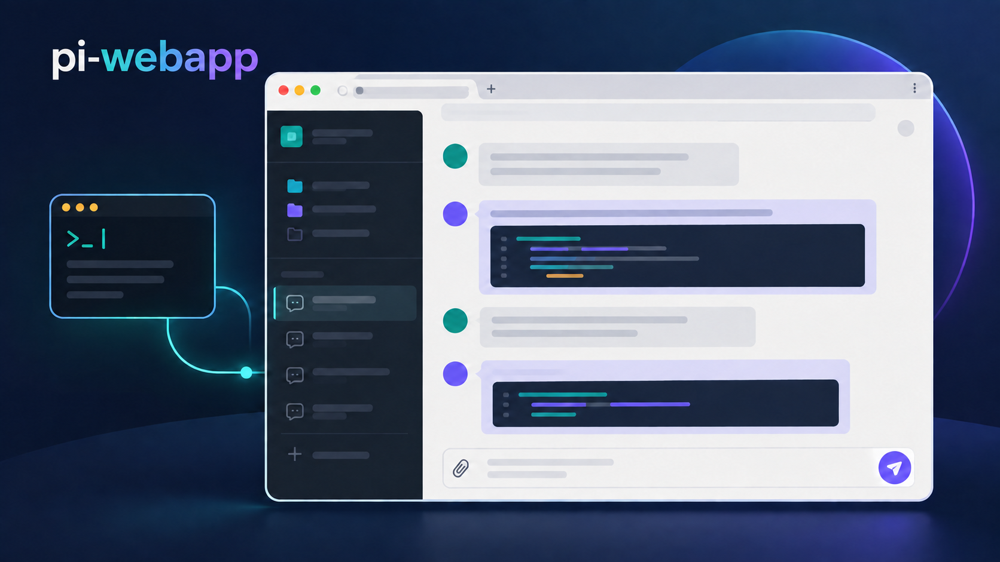

# pi-webapp

[English](README.md)



**pi-webapp** 可以在本地浏览器中打开当前活跃的 Pi 编程 Agent 会话。Agent、工具和会话存储仍由 Pi 运行和管理；浏览器提供实时的对话与控制界面。

## 安装与打开

需要 Node.js 22.19 或更新版本。推荐直接运行：

```bash
npx pi-webapp
```

该命令会在后台启动 Pi，并在本地图形桌面用默认浏览器打开网页，终端可继续使用。若未找到 Pi，会自动通过 npm 安装官方 `@earendil-works/pi-coding-agent`。已有 Pi 需要 0.87.1 或更新版本；启动器不会自动覆盖旧版本。再次运行启动命令会重新打开已有服务。远程或无图形界面时只显示地址；设置 `PI_WEBAPP_AUTO_OPEN=0` 可关闭自动打开。

网页的「设置 → 通用设置 → 应用更新」会检查 npm 上的 `pi-webapp` 新版本。通过 npm 包的后台启动器运行时，点击「升级并重启」会先将新版安装并校验到 Pi 数据目录的 `pi-web/releases/`，然后重启服务，网页会在原地址重新加载。请先等待当前回复结束。若新版无法启动，启动器会恢复旧版服务。`npx` 和全局命令启动均可使用；后续启动会自动选用已安装的新版。此操作不会改动 npm 全局安装。源码目录运行和已有 Pi 终端中的 `/web` 页面可以查看版本，但不能从网页重启。若服务未恢复，可运行 `pi-webapp status` 并查看 `~/.pi/agent/pi-web/launcher.log`。

可用 `npx pi-webapp status` 查看地址，用 `npx pi-webapp stop` 停止后台服务。全局安装后可直接运行 `pi-webapp status` 和 `pi-webapp stop`。

也可以将启动器安装为全局命令：

```bash
npm install -g pi-webapp
pi-webapp
```

如果希望在已有 Pi 终端中使用，仍可按原方式安装扩展：

```bash
pi install npm:pi-webapp
pi
```

在 Pi 中输入 `/web`，即可在默认浏览器中打开界面。对于远程或无图形界面的环境，Pi 也会输出本地访问地址。该地址包含一个随机令牌，仅在当前 Pi 进程运行期间有效。再次输入 `/web` 可以重新打开界面。

## 功能

- 查看当前对话，包括 Markdown 内容、流式输出、可展开的推理过程与工具调用、Token 用量，以及逐轮执行轨迹。
- 发送消息、停止运行、启动新的 Pi 会话，以及切换当前模型或思考级别。
- 浏览工作区和已保存的会话。环境支持时可通过系统目录选择器添加工作区；通过 SSH 使用时，也可使用内置目录浏览器。
- 通过选择、拖放或粘贴附加文件，最多 20 个，每个不超过 20 MB。图片会显示预览，并作为 Pi 图片内容发送。
- 在设置面板中管理外观、Pi 软件包、扩展、技能和模型。模型页可添加模型、编辑显示名称、上下文窗口、最大输出 token 数和输入类型，或恢复内置模型的默认参数；配置写入 Pi 的 `models.json`。网页登录会自动打开提供方授权页；当回调无法到达 Pi 时，仍可手动粘贴授权码。已保存的提供方认证可在这里移除。凭据保留在 Pi 本地的 `auth.json`，不会返回给浏览器。

如果通过 Pi 终端手动输入 `/web`，该终端会话会与浏览器保持同步。使用启动器时，Pi 在后台运行。在其他工作区打开的会话使用 Pi SDK，并加载该工作区的技能和项目上下文；同一进程中不会再次加载扩展。

启动时会从 Pi 已保存的会话中发现工作区，因此先前在其他目录使用 Pi 的会话也会出现在侧边栏。工作区记录和附件继续存放在 Pi 现有的 `pi-web/` 数据目录下。从侧边栏移除工作区不会删除其文件或会话；移除后如需再次显示，可以手动添加。

## 本地开发

```bash
npm install
npm run check
npm run test
npm run build
npm run start
npm run status
npm run stop
```

`npm run start` 会构建项目、在后台启动 Pi 并打开 Web 界面。修改扩展后，运行 `npm run stop`，再运行 `npm run start`；如果使用 `pi -e .` 开发，则在 Pi 中依次输入 `/reload` 和 `/web`。仅刷新旧的浏览器页面不会替换正在运行的连接桥接代码。

源代码位于 `extension/`、`shared/` 和 `web/src/`。npm 软件包仅包含打包并压缩后的 JavaScript 扩展、构建后的 Web 资源、封面图片，以及英文和中文 README；不会发布 TypeScript 源码或 source map。代码压缩会增加阅读发布版本代码的难度，但不会对 JavaScript 加密。

## 发布

`npm publish` 会运行检查、测试和生产构建。`pi-package` 关键词使发布到 npm 的软件包有资格进入 [Pi 软件包目录](https://pi.dev/packages)；目录更新可能晚于 npm。

GitHub Actions 会在针对 `main` 的拉取请求中运行 `check`、`test` 和 `build`。代码推送到 `main` 后会再次运行这些检查，全部通过才自动发布下一个补丁版本。发布版本根据源码版本和 npm `latest` 版本确定，仅在 CI 中写入包文件，不会提交回 Git。如需开始新的次版本或主版本，请在拉取请求中同步提高 `package.json` 和 `package-lock.json` 的版本。每次发布也会将包内 `pi.image` 的地址更新为该版本。

首次自动发布前，请在 npm 的 `pi-webapp` 包设置中配置 Trusted Publishing：GitHub 所有者为 `chengzhiyi`，仓库为 `pi-webapp`，工作流文件名为 `ci.yml`，不设置环境，并允许直接执行 `npm publish`。工作流通过 GitHub OIDC 认证，无需 npm token。`package.json` 中的仓库地址应与 GitHub 仓库保持一致。

## 许可证

MIT。详见 `LICENSE` 文件。
