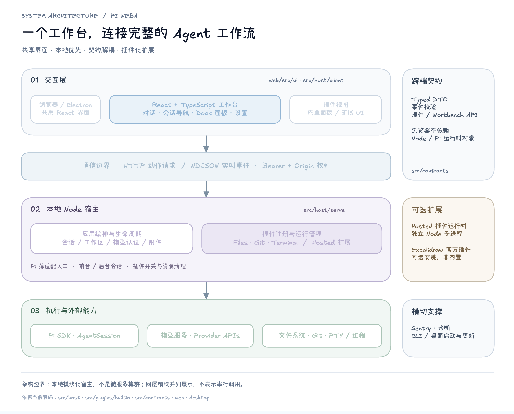

# pi-webapp

### 一个工作台，连接你的 Pi 编程 Agent。

把 AI 对话、项目文件、终端与 Git 放在一起。浏览器与桌面端共用一套工作台，同时保留 Pi 的工具、技能、扩展与终端工作流。

[English](README.md) · [快速开始](#快速开始) · [下载桌面端](#桌面端下载) · [项目架构](#技术架构亮点) · [使用指南](docs/zh/getting-started.md) · [npm](https://www.npmjs.com/package/pi-webapp)

**桌面测试版 build 13：** [macOS Apple 芯片 DMG](https://github.com/chengzhiyi/pi-webapp/releases/download/desktop-v0.1.39-b13/pi-0.1.39-desktop.13-mac-arm64.dmg) · [Intel、Windows 与 Linux 下载](#桌面端下载) · [SHA-256 校验文件](https://github.com/chengzhiyi/pi-webapp/releases/download/desktop-v0.1.39-b13/SHA256SUMS)。测试包未签名或未公证，详见[安全安装说明](docs/desktop-testing.md)。

[](assets/readme/workbench.png)

*一边跟进对话，一边查看消息中链接的源码。截图来自真实界面，使用英文演示数据，并非真实模型执行记录。*

```bash
npx pi-webapp
```

**Web 一条命令启动，桌面端自带运行时，底层仍是你熟悉的 Pi。**

## 为什么选择 pi-webapp？

- **少切窗口，多关注代码。** 一边跟进 Agent，一边查看文件、运行命令、审查差异，让对话与项目上下文留在一起。
- **多个项目，任务不中断。** 各聊天独立运行；切换工作区或新开对话，不会打断原来正在执行的任务。
- **不只看到答案，也能看懂过程。** 流式回复、可展开的推理和工具调用、Token 用量及执行轨迹，让进度更容易掌握。
- **增强 Pi，而不是另起一套。** 继续使用 Pi 的会话存储、模型选择、技能与扩展生态，新增的是可视化工作台，而非替代 Agent 引擎。

## 看图了解工作流

**对话 → 查看源码 → 审查改动 → 运行验证。** 上方工作台把对话和代码放在一起；同一个工具面板，还能让你从差异审查直接进入终端验证。

| 提交前，看清每一处改动 | 不离开对话，直接运行验证 |
| --- | --- |
| [](assets/readme/git-review.png) | [](assets/readme/terminal.png) |
| 对照差异审查，按需暂存要提交的文件。 | 在项目目录执行命令，保留当前对话上下文。 |

*点击图片可查看原图。截图使用隔离的演示仓库，终端实际运行了两项回归测试；不使用提供方凭据或私有项目数据。[图片生成与维护说明](assets/readme/README.md)。*

## Excalidraw：把对话变成可编辑的手绘图稿

**说出想法 → 动手调整 → 保存成果。** 直接让 Pi 绘制架构图、流程图或概念草图，图稿会出现在对话中；点击 **Edit（编辑）** 即可进入原生 Excalidraw 画布，而不是只能查看一张静态图片。

[](assets/readme/excalidraw.png)

*截图来自真实插件界面，使用预设英文示例，并非实时模型生成记录。点击图片可查看原图。*

- **在对话里生成：** 用自然语言描述要画的内容，无需另开绘图服务。
- **亲手调整细节：** 移动图形、修改文字、调整布局，支持原生撤销与重做。
- **保留可编辑成果：** 将 `.excalidraw` 源文件保存到工作区，或从编辑器导出 PNG。

**可选插件：** 在「**插件 → Hosted 插件**」中显式安装并启用 `@chengzhiyi/pi-excalidraw`，需要可用的兼容发行版。插件不随宿主内置，也不会自动安装，无需额外绘图服务账号。[安装、保存与恢复说明](docs/diagrams.md)。

## 核心功能

| 能力 | 你可以做什么 |
| --- | --- |
| **实时 Agent 对话** | 发送消息与图片/文件附件，暂停与继续任务，切换模型及思考级别；在上下文中阅读 Markdown、代码、推理和工具结果。 |
| **多项目与多会话** | 发现已有 Pi 会话、添加工作区，在独立运行的聊天之间切换；回来时继续查看输出和待处理的插件交互。 |
| **对话旁的文件预览** | 浏览工作区，点击聊天中的文件路径，在只读标签页查看高亮代码、Markdown 与图片。 |
| **真正的交互式终端** | 在工作区启动 shell，交互输入、Ctrl+C；切换聊天或面板时保留进程与输出。 |
| **Git 审查与操作** | 查看改动和内联差异、逐文件暂存/取消暂存、提交暂存区、创建/切换本地分支，并用分支关系图浏览提交历史。 |
| **灵活的工作台布局** | 调宽、分栏、展开工具面板，或进入工作区专注模式，同时保留导航入口。各聊天保留自己的工具标签，直到网页刷新。 |
| **模型、技能与插件** | 配置提供方和模型，管理 Pi 软件包/扩展/技能，启停内置文件、终端与 Git；兼容的 Web 插件还可贡献自己的界面。 |
| **浏览器与桌面入口** | 用后台启动器打开 Web，从 Pi 终端输入 `/web`，或运行自带 Node/Pi 的 Electron 桌面应用。 |

> 聊天独立运行，但同一工作树中的文件和 Git 改动是共享的。切换聊天不会停止任务；停止服务会结束其后台任务。终端与 Agent 工具使用你的系统权限，不是沙箱环境。

## 快速开始

### Web：一条命令启动

需要 **Node.js 22.19+** 和 npm。在项目目录运行：

```bash
npx pi-webapp
```

启动器使用随包锁定的 **Pi SDK 1.3.0** 启动本地后台服务，并打开浏览器；无需安装或修改全局 Pi。再次运行命令即可打开已有服务。

无图形界面时显示本地地址；设置 `PI_WEBAPP_AUTO_OPEN=0` 可关闭浏览器自动打开。

1. 进入「**设置 → 模型**」，配置提供方并选择有权使用的模型。
2. 选择或添加工作区，开始一次对话。
3. 打开对话右上角的工具面板，在 Agent 旁边使用「**文件**」「**终端**」或「**Git 改动**」。

模型访问权限需自行配置；本地界面不等于离线推理。请勿分享带访问令牌的本地 URL，也不要把服务直接暴露到公网。

```bash
npx pi-webapp status   # 查看运行中的服务地址
npx pi-webapp stop     # 完成当前任务后停止服务
```

习惯全局命令？先运行 `npm install -g pi-webapp`，再运行 `pi-webapp`。

**升级：** 通过 npm 后台启动器运行时，可在「设置 → 通用设置 → 应用更新」中「升级并重启」；新版启动失败会回退。请先结束活跃任务。源码运行和 Pi 终端 `/web` 页面仅显示版本信息，不能从网页重启。详见[更新指南](docs/zh/updates.md)。

### 已经在终端使用 Pi？

```bash
pi install npm:pi-webapp
pi
```

在 Pi 中输入 **`/web`** 即可。浏览器与该终端会话保持同步，Agent、工具和会话存储继续由 Pi 管理；退出该 Pi 进程会结束其服务。

## 桌面端下载

**最新桌面测试版：[pi 0.1.39 · build 13](https://github.com/chengzhiyi/pi-webapp/releases/tag/desktop-v0.1.39-b13)。** 请按系统与芯片选择安装包：

| 平台 | 下载 |
| --- | --- |
| **macOS · Apple 芯片（arm64）** | [下载 DMG](https://github.com/chengzhiyi/pi-webapp/releases/download/desktop-v0.1.39-b13/pi-0.1.39-desktop.13-mac-arm64.dmg) |
| **macOS · Intel（x64）** | [下载 DMG](https://github.com/chengzhiyi/pi-webapp/releases/download/desktop-v0.1.39-b13/pi-0.1.39-desktop.13-mac-x64.dmg) |
| **Windows · x64** | [下载 EXE 安装包](https://github.com/chengzhiyi/pi-webapp/releases/download/desktop-v0.1.39-b13/pi-0.1.39-desktop.13-win-x64.exe) |
| **Linux · x64** | [下载 AppImage](https://github.com/chengzhiyi/pi-webapp/releases/download/desktop-v0.1.39-b13/pi-0.1.39-desktop.13-linux-x86_64.AppImage) |

[全部版本](https://github.com/chengzhiyi/pi-webapp/releases) · [SHA256SUMS 校验文件](https://github.com/chengzhiyi/pi-webapp/releases/download/desktop-v0.1.39-b13/SHA256SUMS) · [构建与运行时信息](https://github.com/chengzhiyi/pi-webapp/releases/download/desktop-v0.1.39-b13/desktop-release.json)

**build 12 修复桌面退出无响应。** 退出确认会显示在主窗口前方；加载中关闭不再弹出阻塞警告；后台停止失败时可以选择“仅退出桌面”。已有后台服务和任务可继续运行。

**build 13 新增旧共享后台的安全启动器交接。** build 12 本身支持体验版，但附加到 build 10 启动的后台后，旧启动器能力仍会保留。安装 build 13 后，先在稳定版通道升级业务包，再使用「pi → 安全切换到当前桌面启动器…」。交接会等待聊天空闲、终端关闭和真实图稿保存确认，保留原本地地址与恢复副本，不会强制停止旧进程；之后再切换体验版并在线升级。通道和所选版本在重启后保持；体验版选择 npm `latest` 与 `alpha` 中较新的版本，不会把旧 alpha 当作升级。界面分别显示当前窗口、后台启动器和业务包版本。已有 npm 0.1.26/0.1.27 后台仍可安全连接，不接管其任务。

桌面应用名为 **pi**，自带 Node 和 Pi，无需另装运行时。支持复用兼容的 Web 服务、在浏览器中打开同一服务，以及退出时选择是否保留后台任务。模型凭据、Git/SSH 配置和项目工具链仍需自行准备。

- **安装：** macOS 从 DMG 将 **pi.app** 拖入“应用程序”；Windows 运行 EXE；Linux 为 AppImage 添加执行权限后运行，不支持 FUSE 时可参考该版本发布说明中的替代方式。
- **核对：** 对照同一 Release 的 `SHA256SUMS` 校验安装包，在「pi → 关于 pi」确认 **build 13**。替换前先退出旧桌面，不要删除 `~/.pi`。
- **测试版边界：** 当前为自愿参与的预发布测试包，不是具有发布者签名的稳定发行版。macOS 使用 ad-hoc 临时签名、未经过 Apple 公证，可能被 Gatekeeper 拦截；请按 [macOS 测试安装说明](docs/desktop-testing.md)核验，失败就停止。Windows/Linux 安装包未签名。不要全局关闭系统安全保护。桌面外壳更新仍需手动安装，业务包更新在应用设置中进行；暂不包含 Windows ARM 和 Linux ARM。

## 技术架构亮点

**共享 React 工作台 → 本地 Node 宿主 → Pi 执行能力。** 这是本地运行的模块化应用，不是微服务集群。Pi 负责 Agent 执行与会话持久化；pi-webapp 负责界面、会话编排与工作区能力。

[](assets/readme/architecture-zh.png)

*三条主干连线突出层间边界；同层模块为并列能力，不表示串行调用。点击图片可查看原图。*

| 设计 | 带来的价值 |
| --- | --- |
| **薄 Pi 适配层，独立宿主职责** | Agent 接入保持轻量，服务编排、浏览器 UI 与工作区能力各有归属，避免所有逻辑挤进单一扩展入口。 |
| **类型化、可校验的跨端契约** | 浏览器只依赖传输 DTO，不直接耦合 Node/Pi 运行时对象；HTTP 动作与 NDJSON 事件明确划分命令和实时状态更新。 |
| **能力插件化，而非页面堆叠** | Git、文件和终端分别拥有 server/client/contracts 与清理逻辑，由注册表分发请求；标签、停靠、专注模式和会话身份交给宿主工作台。 |
| **面向生命周期的会话管理** | 离开聊天仍保留后台进度与待处理交互；切换聊天保留工具资源，关闭标签则释放对应资源。 |
| **宿主边界上的操作保护** | 本地传输校验令牌与请求来源；文件预览限制工作区及符号链接范围；Git 写入拒绝过期状态，并协调同工作树的已知聊天。这些检查不等于操作系统沙箱。 |
| **多入口复用同一套界面** | React + TypeScript 构建工作台，Vite/esbuild 完成打包，Electron 提供桌面外壳，无需另维护一套桌面对话 UI。 |

**绘图为可选扩展，而非内置能力：** 在插件管理中显式安装、启用官方 `@chengzhiyi/pi-excalidraw`。宿主不携带编辑器和专用字体，首次离线启动不会自动安装。Hosted 插件使用独立 Node 子进程管理生命周期，但不是安全沙箱。本分支开发协议和插件产物仅用于验证，并非已发布版本。更新行为、旧图稿及备份保留方式见[绘图迁移与恢复](docs/diagrams.md)。

### 源码导航

| 目录 | 职责 |
| --- | --- |
| `web/src/ui/` · `src/host/client/` | 共享 UI、对话外壳、工作台与浏览器插件管理 |
| `src/host/server/` | 传输、会话、工作区、模型配置与插件生命周期 |
| `src/adapters/pi/` | 轻量 Pi 扩展入口 |
| `src/plugins/builtin/` | 文件、Git、终端，各自拥有服务端、客户端和契约 |
| `src/contracts/` · `src/platform/telemetry/` | 跨端数据契约与共享诊断 |
| `bin/` · `desktop/` | CLI 启动器与 Electron 外壳 |

深入了解：[架构与职责划分](docs/architecture.md) · [Web 插件接入与生命周期](docs/web-plugins.md)。

## 使用指南与开发

- **新用户：** [首次对话](docs/zh/getting-started.md) · [会话管理](docs/zh/sessions.md) · [工作区工具](docs/zh/workspace-tools.md)
- **配置与排错：** [模型、软件包与技能](docs/zh/configuration.md) · [版本更新](docs/zh/updates.md) · [常见问题](docs/zh/troubleshooting.md)
- **参与开发：** [架构说明](docs/architecture.md) · [Web 插件](docs/web-plugins.md) · [桌面构建](docs/desktop.md)

指南随源码演进，可能与你安装的版本不同；桌面端支持范围以上方已核实的下载链接及对应版本发布说明为准。

### 本地开发

```bash
npm ci
npm run check
npm test
npm run start   # 构建并启动本地服务
```

`npm run start` 会构建并启动后台服务。修改扩展代码后，运行 `npm run stop` 再运行 `npm run start`；仅刷新网页不会替换桥接代码。使用 `pi -e .` 开发时，重新构建后在 Pi 中输入 `/reload`，再输入 `/web`。

桌面开发：`npm run desktop:prepare` → `npm run desktop:start`；`npm run desktop:package` 在 `desktop-release/` 生成当前系统的安装包。可信本地插件联调可参考[插件说明](docs/web-plugins.md)中的 `PI_WEBAPP_PLUGIN_DEV_ROOTS`。

---

[提交问题或功能建议](https://github.com/chengzhiyi/pi-webapp/issues) · [在 GitHub 上 Star 项目](https://github.com/chengzhiyi/pi-webapp)

基于 MIT 许可证开源。详见 [LICENSE](LICENSE)。
